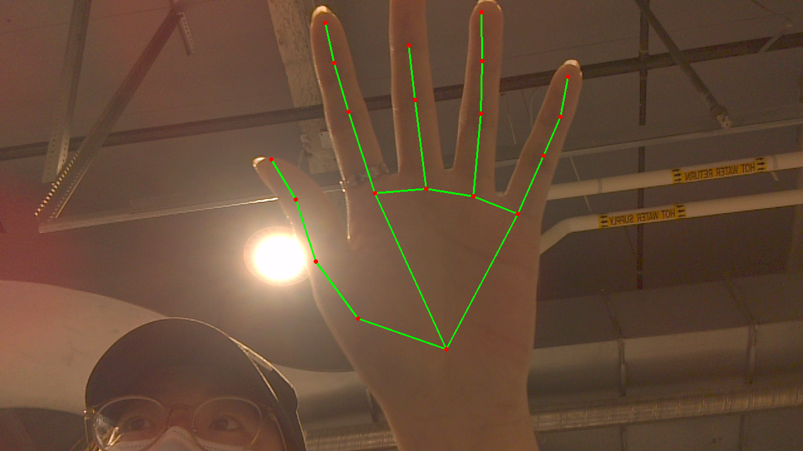

Lab 0: Hardware setup
===
The goal of this lab is for you to become more familiar with the hardware platform you will be working with this semester, and for you to complete basic setup so that everyone in the group should be able to work remotely on the device going forward. By the end of class today, everyone in your group should be able to ssh in to the device, use the camera to take a picture, record audio, run a basic NLP model, and run a basic CV model. 

If you successfully complete all those tasks, then your final task is to write a script that pipes together I/O with a model. For example, you could write a script that uses the camera to capture an image, then runs classification on that image. Or you could capture audio, run speech-to-text, then run sentiment analysis on that text.

Group name: Group-YU
---
Group members present in lab today: Yuqing Qin, Yukun Xia

1: Set up your device.
----
Depending on your hardware, follow the instructions provided in this directory: [Raspberry Pi 4](https://github.com/strubell/11-767/blob/main/labs/lab0-setup/setup-rpi4.md), [Jetson Nano](https://github.com/strubell/11-767/blob/main/labs/lab0-setup/setup-jetson.md), [Google Coral](https://coral.ai/docs/dev-board/get-started/). 
1. What device(s) are you setting up?

    A: Jetson Nano 2GB

2. Did you run into any roadblocks following the instructions? What happened, and what did you do to fix the problem?

    A: Yes. 

    Problem 1: After system image was written into SD card, we powered on Jetson Nano, but it failed to boot and was stuck at `A start job is running for End-user configuration after initial OEM installation (10min 25s / no limit)`. The solution was to press `pressed ctrl+alt+del`.

    Problem 2: Initially, `sudo apt -y install curl` was not runnable, and we had to enable `Source code` in `Software & Updates`.

    Problem 3: `torchvision` was not automatically installed with pytorch, and its installation script was not written in the setup-jetson.md. We tried a [thrid-party tutorial](https://qengineering.eu/install-pytorch-on-jetson-nano.html) with precompiled wheel provided, but we failed at installing the wheel, with an error message `error: package directory 'torch/cuda' does not exist`. Then we tried the [Nvidia's instruction](https://forums.developer.nvidia.com/t/pytorch-for-jetson-version-1-9-0-now-available/72048) to build `torchvision` from scratch. The commands we ran were documented in the following.
    ```
    $ sudo apt-get install libjpeg-dev zlib1g-dev libpython3-dev libavcodec-dev libavformat-dev libswscale-dev
    $ git clone --branch release/0.10.0 https://github.com/pytorch/vision torchvision   # see below for version of torchvision to download
    $ cd torchvision
    $ export BUILD_VERSION=0.10.0  # where 0.x.0 is the torchvision version  
    $ python3 setup.py install --user
    $ cd ../  # attempting to load torchvision from build dir will result in import error
    ```

3. Are all group members now able to ssh in to the device from their laptops? If not, why not? How will this be resolved?

    A: Yes

2: Collaboration / hardware management plan
----
4. What is your group's hardware management plan? For example: Where will the device(s) be stored throughout the semester? What will happen if a device needs physical restart or debugging? What will happen in the case of COVID lockdown?

    Location: We'll keep our Jetson Nano at the MRSD Lab in the basement of NSH.

    Physical Operation: Yuqing and Yukun are both MRSD students, and we'll usually will stay in the MRSD Lab. 

    COVID Lockdown: MRSD Lab is large enough to maintain social distancing, so our group progress is not likely to be affected by potential lockdown.


3: Putting it all together
----
5. Now, you should be able to take a picture, record audio, run a basic computer vision model, and run a basic NLP model. Now, write a script that pipes I/O to models. For example, write a script that takes a picture then runs a detection model on that image, and/or write a script that runs speech-to-text on audio, then performs classification on the resulting text. Include the script at the end of your lab report.

    A: The script is in scetion 8.

6. Describe what the script you wrote does (document it.) 

    A: The script uses opencv and gstreamer to read image from camera. Then the script transforms the image from BGR to RGB, and is fed into mediapipe's hand detection function `hands.process(img)`. The detection results finally are drawn on the original image, and stored to `output.png`.

    


7. Did you have any trouble getting this running? If so, describe what difficulties you ran into, and how you tried to resolve them.

    A: Yes. 

    Problem 1: After OpenCV and OpenCV-Contrib was updated to 4.5.3, we lost the connection to the camera. We finally found the issue was that our Opencv-Contrib didn't support gstreamer, and the issue was resolved by reinstalling OpenCV-Contrib 4.5.3 with the wheel provided by Taiqi He in slack. 

    Problem 2: The Mediapipe we installed doesn't contain a module `mp.solutions.drawing_styles`, so we simply deleted those related lines.

8. Script

```Python
import cv2, os, sys
import mediapipe as mp

mp_drawing = mp.solutions.drawing_utils
mp_hands = mp.solutions.hands  # load hand pose model

def gstreamer_pipeline(capture_width=1280, capture_height=720, 
                       display_width=1280, display_height=720,
                       framerate=60, flip_method=0):
  return (
        "nvarguscamerasrc ! "
        "video/x-raw(memory:NVMM), "
        f"width=(int){capture_width}, height=(int){capture_height}, "
        f"format=(string)NV12, framerate=(fraction){framerate}/1 ! "
        f"nvvidconv flip-method={flip_method} ! "
        f"video/x-raw, width=(int){display_width}, height=(int){display_height}, format=(string)BGRx ! "
        "videoconvert ! "
        "video/x-raw, format=(string)BGR ! appsink"
    )

HEIGHT=1280
WIDTH=1920
center = (WIDTH / 2, HEIGHT / 2)
M = cv2.getRotationMatrix2D(center, 180, 1.0)

nano = True
if nano:
  cam = cv2.VideoCapture(gstreamer_pipeline(), cv2.CAP_GSTREAMER)
else:
  # Start Camera
  cam = cv2.VideoCapture(0)
  cam.set(cv2.CAP_PROP_FRAME_WIDTH, WIDTH)  # 3280
  cam.set(cv2.CAP_PROP_FRAME_HEIGHT, HEIGHT) # 2464


if cam.isOpened():
  val, img = cam.read()
  if not val:
    print("Failed to read image from camera")
    exit()

  # convert input image from BGR to RGB
  img = cv2.cvtColor(cv2.flip(img, 1), cv2.COLOR_BGR2RGB)
  img.flags.writeable = False

  with mp_hands.Hands(
      min_detection_confidence=0.5,
      min_tracking_confidence=0.5) as hands:

    results = hands.process(img)

    # Draw the hand annotations on the img.
    img.flags.writeable = True
    img = cv2.cvtColor(img, cv2.COLOR_RGB2BGR)

    if results.multi_hand_landmarks:
      for hand_landmarks in results.multi_hand_landmarks:
        mp_drawing.draw_landmarks(
              img,
              hand_landmarks,
              mp_hands.HAND_CONNECTIONS)

      cv2.imwrite('output.png', img)

```