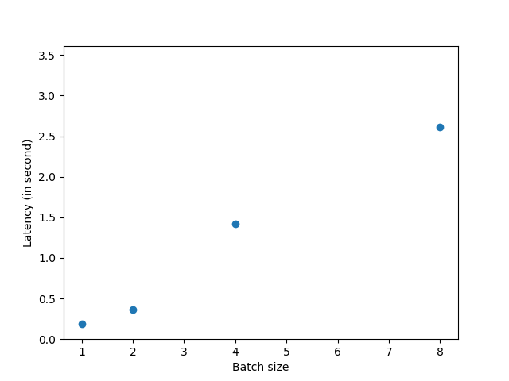

Lab 2: Benchmarking
===
The goal of this lab is for you to benchmark and compare model inference efficiency on your devices. **You should benchmark 2*N* models or model variants, where *N* is the size of your group (so, two models per person.)** For now, if you don't have appropriate evaluation data in place that's fine; you can provide pretend data to the model for now and just evaluate efficiency.

Ideally, the models you benchmark will be related to and useful for your class project, but at the very least the efficiency metrics should be useful.

Include any code you write to perform this benchmarking in your Canvas submission (either as a link to a folder on github, in a shared drive, zip, etc).

Group name: YU
---
Group members present in lab today: Yukun Xia (yukunx), Yuqing Qin (yuqingq)

1: Models
----
1. Which models and/or model variants will your group be benchmarking? Please be specific.

MobileNetv2, MobileNet v3_small, ResNet18, SqueezeNet. 

2. Why did you choose these models?

Our project will use SuperPoint, which uses VGG as backbone. One of our optimization approach is to change the backbone to a more effecient one. MobileNet is one of the choices. We also considered other smaller network as well, i.e. SqueezeNet. ResNet18 is the baseline model which has more parameters than other three.

3. For each model, you will measure parameter count, inference latency, and energy use. For latency and energy, you will also be varying a parameter such as input size or batch size. What are your hypothesis for how the models will compare according to these metrics? Explain.

- Parameter count: ResNet will have much more parameters compared to others. MobileNet optimizes the convolution operation, which makes the total number of parameters decrease a lot. SqueezeNet uses another optimization block (squeeze and expand), which also makes its parameter size smaller.

- inference latency: Generally, with larger batch size, running on CPU will result in larger latency for both models listed above. For ResNet, since we only use a small ResNet model, it should run fast. Also, MobileNet and SqueezeNet restructure the operations to make the parameters low enough, which should also give faster inference time. 

- Energy usage: Energy usage is affected by the FLOPs and the No. of parameters. ResNet might consume more energy compared to others since it has more parameters. SqueezeNet would have less power consumption compared to MobileNet for the same reason.


2: Parameter count
----
1. Compute the number of parameters in each model. Remember, in Torch you should be able to start with something like this:
   ```
   num_params = sum([np.prod(p.size()) for p in model.parameters()])
   ```

   Model | Num. of Params
   --- | ---
   MobileNetv2 | 	3504872
   MobileNetv3_small | 	2542856
   ResNet18 | 		11689512
   SqueezeNet | 	1235496
   
2. Does this number account for any parameter sharing that might be part of the model you're benchmarking? 

We are using CNN, which has the parameter sharing in the `conv` layer. The above parameter count considered the sharing weight, and only calculate once for those `conv` layer.

3. Any difficulties you encountered here? Why or why not?

We first tried VGG model on CPU and GPU, which is the model used in SuperPoint. It turns out that Jetson 2GB cannot load VGG model due to limited memory and power.

3: Latency
----
1. Compute the inference latency of each model. You should do this by timing the forward pass only. For example, using `timeit`:
    ```
    from timeit import default_timer as timer

    start = timer()
    # ...
    end = timer()
    print(end - start) # Time in seconds, e.g. 5.38091952400282
    ```
    Best practice is to not include the first pass in timing, since it may include data loading, caching, etc.* and to report the mean and standard deviation of *k* repetitions. For the purposes of this lab, *k*=10 is reasonable. (If standard deviation is high, you may want to run more repetitions. If it is low, you might be able to get away with fewer repetitions.)
    
    For more information on `timeit` and measuring elapsed time in Python, you may want to refer to [this Stack Overflow post](https://stackoverflow.com/questions/7370801/how-to-measure-elapsed-time-in-python).

    Model | Latency (CPU: second)
    --- | ---
    MobileNetv2 | 	5.28
    MobileNetv3_small | 2.91
    ResNet18 |		0.36
    SqueezeNet |	0.29


2. Repeat this, but try varying one of: batch size, input size, other. Plot the results (sorry this isn't a notebook):
   ```
   import matplotlib.pyplot as plt
   
   plot_fname = "plot.png"
   x = ... # e.g. batch sizes
   y = ... # mean timings
   
   plt.plot(x, y, 'o')
   plt.xlabel('e.g. batch size')
   plt.ylabel('efficiency metric')
   plt.savefig(plot_fname)
   # or plot.show() if you e.g. copy results to laptop
   ```

2.1 MobileNetv2


2.2 MobilevNet3_small


2.3 Resnet18


2.4 SqueezeNet



4. Any difficulties you encountered here? Why or why not?

It takes much longer time to run models (i.e. MobileNet) on GPU compared to CPU at inference time. Running on GPU with MobileNetv2 takes about 150s, while running with CPU only takes about 5s. It's possibly because the I/O loading to GPU takes more time than CPU.

4: Energy use
----
1. Compute the energy use of each model. You can use the `powertop` tool on RPi and Jetson (must be run as root):
    ```
    sudo apt install powertop
    pip3 install powertop
    ```
    and/or the `jtop` tool on Jetson (see installation instructions [here](https://github.com/rbonghi/jetson_stats/)). Follow the same procedure as you used to compute latency, but this time compute energy: (avg) watts * time.

 Our group is using 2GB Jetson, which does not have power sensor. We cannot retrieve the power stat from neither jtop nor powertop.

    Model | Energy (CPU: Joule)
    --- | ---
    MobileNetv2 | 	N/A
    MobileNetv3_small | N/A
    ResNet18 |		N/A
    SqueezeNet |	N/A

2. Any difficulties you encountered here? Why or why not?

Our group is using 2GB Jetson, which does not have power sensor. We cannot retrieve the power stat from neither jtop nor powertop (powerstats). We also tried getting the power information from the system file, which is supposed to be located at `/sys/bus/i2c/drivers/ina3221x/6-0040/`. It turns out that the `/6-0040` does not exist in Jetson 2GB either. We also tried to replace the power supply to power bank, but no power stats showed up either. 

5: Discussion
----
1. Analyze the results. Do they support your hypotheses? Why or why not? Did you notice any strange or unexpected behavior? What might be the underlying reasons for that behavior? 

Most of the resutls aligned with our expectation, i.e. number of parameters. ResNet has more paramters in total compared to other three. For latency, we saw the ResNet18 runs much faster than MobileNet on CPU, but the ResNet has 3x paramters, and 6x FLOPs compared to MobileNet. Possibly because MobileNet has higher operational intensity, which makes it run slower than expected.   

6: Extra
----
A few options:
1. Compute FLOPs for each of your models. If you're using Transformer-based models, you might be able to use or modify the [`flops_counter.py`]() script in this directory. If you're using a CNN-based model, then you might be able to use or modify code in [this project](https://github.com/1adrianb/pytorch-estimate-flops) or similar. 

    Model | GFLOPs
    --- | ---
    MobileNetv2 | 	0.31
    MobileNetv3_small | N/A  (segmentation fault, possibly not support well by count\_ops or onnx)
    ResNet18 |		1.83
    SqueezeNet |	0.36

2. Evaluate on different hardware (for example, you might run the same benchmarking on your laptop.) Compare the results to benchmarking on your device(s).
3. Use real evaluation data and compare accuracy vs. efficiency. Describe your experimental setup in detail (e.g. did you control for input size? Batch size? Are you reporting average efficiency across all examples in the dev set?) Which model(s) appear to have the best trade-off? Do these results differ from benchmarking with synthetic data? Why or why not?

----
\* There are exceptions to this rule, where it may be important to include data loading in benchmarking, depending on the specific application and expected use cases. For the purposes of this lab, we want to isolate any data loading from the inference time due to model computation.
