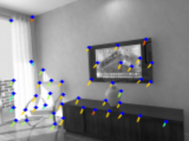

Lab 4: Baselines and Related Work
===
The goal of this lab is for you to survey work related to your project, decide on the most relevant baselines, and start to implement them.

Ideally, the outcome of this lab would be: (1) the related work section of your project report is written and (2) baselines have been benchmarked.

Group name: YU
---
Group members present in lab today: Yuqing Qin, Yukun Xia

1: Related Work
----
1. Choose at least 2 pieces of related work per group member. For each piece of related work, write a paragraph that includes:
    - Summary of the main contributions of that work.
    - How your proposed project builds upon or otherwise relates to that work.
    
    * Paper 1: [SuperPoint: Self-Supervised Interest Point Detection and Description](https://arxiv.org/pdf/1712.07629.pdf)
        * Contribution summary
            * Superpoint is a deep learning feature point detector and descriptor with self-supervised learning. Real images with different homography warpings will be used to detect feature points, and then the repeatable features will be collected as the training target. This process can be repeated to keep refining the detector. Also, unlike other classical pipeline (two stage pipeline: first detector, then descriptor), SuperPoint takes one image or pair of images as input, and do interest point detection and feature descriptor at the same time. It shares the feature representations from the encoder network, and also shares the computation for these two tasks.

        * Relationship to the proposed project
            * This paper will serve as the baseline of the proposed project. 

    * Paper 2: [UnsuperPoint: End-to-end Unsupervised Interest Point Detector and Descriptor](https://arxiv.org/pdf/1907.04011.pdf)
        * Contribution summary
            * Formulate the deep learning feature point detection as a regression rather than a classification problem. The authors claimed that its performance surpassed SuperPoint.
        * Relationship to the proposed project
            * An extension to this project
    
    * SIFT:
        * Contribution Summary:
            * SIFT stands for Scale Invariant Feature Transform, which is a well-known feature description approach used in various applications (i.e. SLAM). SIFT determines the interest points from DoG (Difference of Gaussian), and calculates the spatial histogram of the gradients around the interst points as the feature descriptor. SIFT gives robust description around key point, since it guarentees scale, orientation invariance, and even illumination invariance.

        * Relationship to the proposed project:
            * SIFT is the well-known feature description algorithm, which is always used in the research as the baseline. If we have enough time, we would like to iterate on SIFT as another baseline for our project. 

    * FAST:
        * Contribution Summary:
            * FAST (Features from Accelerated Segment Test) is a corner detection algorithm (keypoint detection) proposed in 2006. Compared to other key point detection algorithms, the main advantage for FAST is its computational efficiency. This allows it to run with limited computational resources devices(i.e. robot) with real-time performance. Also, after the machine learning approach added into FAST, it achieves better performance. 

        * Relationship to the proposed project:
            * FAST is the feature detector, which is usually used in the pipeline as the first step. The SuperPoint network outputs the detector and descriptor in parallel. We could later compare SuperPoint detector performance with FAST. 

2: Baselines
----
1. What are the baselines that you will be running for your approach? Please be specific: data, splits, models and model variants, any other relevant information.

We are running pre-trained SuperPoint network on Hpatches dataset as our baseline. The baseline model is testing on Jetson Nano 4GB.

2. These baselines should be able to run on your device within a reasonable amount of time. If you haven't yet tried to run them, please include a back-of-the-envelope calculation of why you think they will fit in memory. If the baselines will not fit in memory, return to (1) and adjust accordingly.

The pre-trained SuperPoint model can run in Jetson. We have tested the model performance with Jetson.

3. How will you be evaluating your baselines?

We are evaluating the baseline (SuperPoint model) on the below metrics:

- Latency : the average latency to run 30 samples
- No. of params : the total number of parameters of the entire model
- GPU memory usage : memory usage to load model and run the model on images (other metrics are testing with CPU)
- FLOPs : floating point operations 
- Performance level:
    - Repeatability: Evaluate the detector
    - Homography estimation: Evaluate the descriptor

4. Implement and run the baselines. Document any challenges you run into here, and how you solve them or plan to solve them.

- Latency: 0.306s
- Total Number of Params:  1300865
- GPU memory usage: 2.4 GB
- FLOPs:

===================
Operation OPS         
--------  ----------  
conv1a    12288000    
relu_1    2457600     
conv1b    709017600   
relu_2    2457600     
pool      921600      
conv2a    177254400   
relu_3    614400      
conv2b    177254400   
relu_4    614400      
pool_1    230400      
conv3a    88627200    
relu_5    307200      
conv3b    177100800   
relu_6    307200      
pool_2    115200      
conv4a    44275200    
relu_7    76800       
conv4b    44275200    
relu_8    76800       
conv_pa   88550400    
relu_9    153600      
conv_pb   5011500     
conv_da   88550400    
relu_10   153600      
conv_db   19737600    
-------   ---------   
Input size: (1, 1, 120, 160)
1,640,429,100 FLOPs or approx. 1.64 GFLOPs

- Performance level:
    - Repeatability(detector): 0.641
    - Homography estimation(descriptor): 0.923

- Sample output:

Challenges: The pretrained Superpoint model was not runnable on GPU with too much memory usage. The solution was to increase the swap to 8GB, and turn off the ubuntu GUI. The first one ensures that even if the left memory is only ~500MB, Jetson will keep running the model without freezing, and the latter one saved about 300MB memory.

5. If you finish running and evaluating your baselines, did the results align with your hypotheses? Are there any changes or focusing that you can do for your project based on insights from these results?

The model runs much faster than we expected, and even the model size is smaller than what we thought. By looking at the paper and the model structure again, we found out that the SuperPoint network uses VGG-style backbone, but it does not use the heavy-load dense layer, which is originally used in VGG16. From this insights, we have to change our project focus a little bit. Only applying quantization might not have a big impacts, we would focus on retraining the network with other backbones(i.e MobileNet, Resnet, other larger backbone) and testing with other optimization approaches as well. 

3: Extra
----
More related work, more baselines, more implementation, more analysis. Work on your project.

FAQ
----
1. Our baseline is the SotA model from XXX 2021 which doesn't fit on device.  

Yikes! I think you meant to say -- "We used some very minimal off the shelf components from torchvision/huggingface/... to ensure our basic pipeline can run"

2. We're evaluating our baseline on accuracy only

I think you meant to say -- "We plan to plot accuracy against XXXX to see how compute and performance trade-off. Specifically, we can shrink our baseline by doing YYYY"
