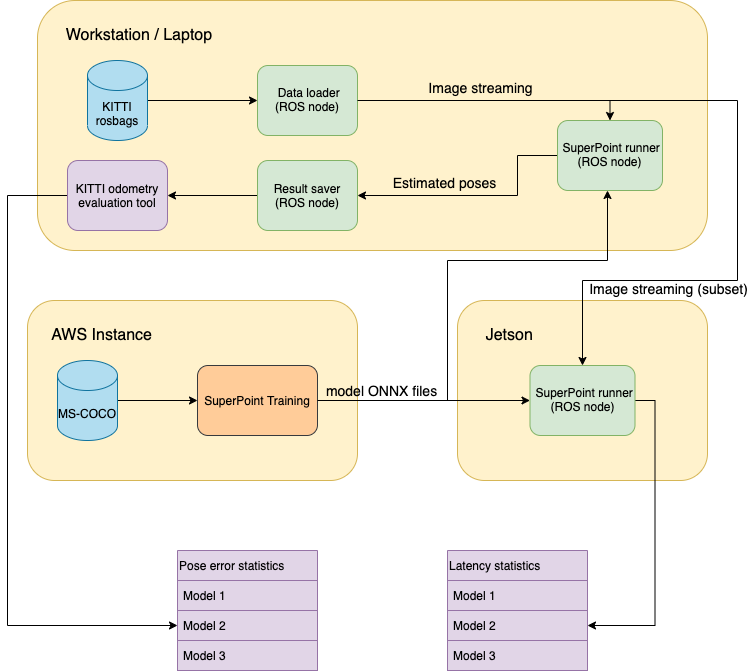

Lab 5: Group work on projects
===
The goal of this lab is for you to make progess on your project, together as a group. You'll set goals and work towards them, and report what you got done, chaellenges you faced, and subsequent plans.

Group name:
---
Group members present in lab today: Yuqing Qin (yuqingq), Yukun Xia (yukunx)

1: Plan
----
1. What is your plan for today, and this week? 

Today, we will detail our system design, and specify the workflow for our project. We would also go over the SuperPoint retraining tutorial, and write a script to revise the model structure. 

2. How will each group member contribute towards this plan?

We will work together today on the workflow design and SuperPoint model revision. Later this week, Yukun would continue work on the benchmarking the performance of Superpoint. Yuqing will work on retraining the model with new architecture.

2: Execution
----
1. What have you achieved today / this week? Was this more than you had planned to get done? If so, what do you think worked well?

We have discussed our project scale, structure, design details this week. The general workflow is shown below. From this worflow, we make our project scale much more clear. 

  

  <em>Test system design</em>

&nbsp;

  

  <em>(Potential) Live demo system</em>

2. Was there anything you had hoped to achieve, but did not? What happened? How did you work to resolve these challenges?

We were planning to retrain the network with new architecture. After researching on the retraining repository, we found that training a SuperPoint on our devices  might take too long for us. We have to utilize AWS to retrain, so we asked for AWS credit during the lab session, and start to setup during the lab.

3. What were the contributions of each group member towards all of the above?

Yukun is working on the workflow generation and benchmarking the performance with pretrained model.
Yuqing is working on writing the script to retraining SuperPoint and setting up AWS.

3: Next steps
----
1. Are you making sufficient progress towards completing your final project? Explain why or why not. If not, please report how you plan to change the scope and/or focus of your project accordingly.

Yes. We are working on benchmarking the model performance, and model retraining with new architecture. Once we have new model, we could compare with our baseline and see the improvements.

2. Based on your work today / this week, and your answer to (1), what are your group's planned next steps?

Keep working on retraining the model, and start doing the quantization.

3. How will each group member contribute towards those steps? 

Yuqing will continue working on retraining the network.
Yukun will continue working on benchmarking the model from retraining.
We will work together on the quantization.
