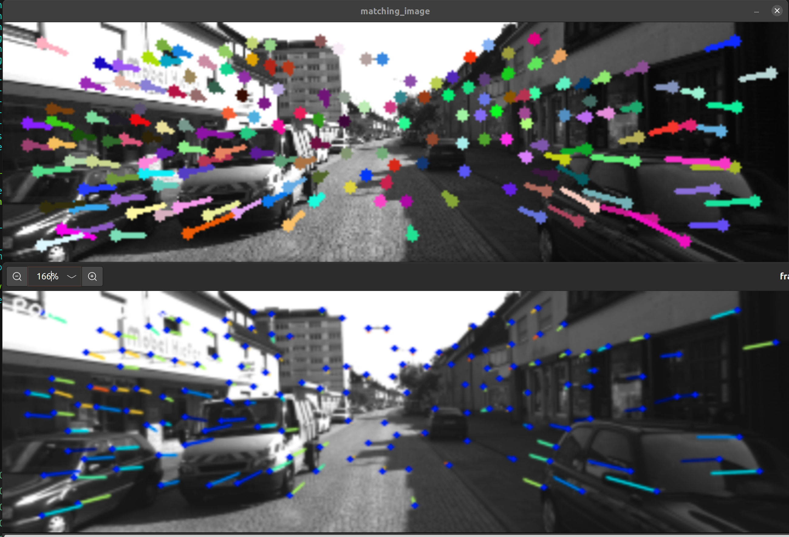
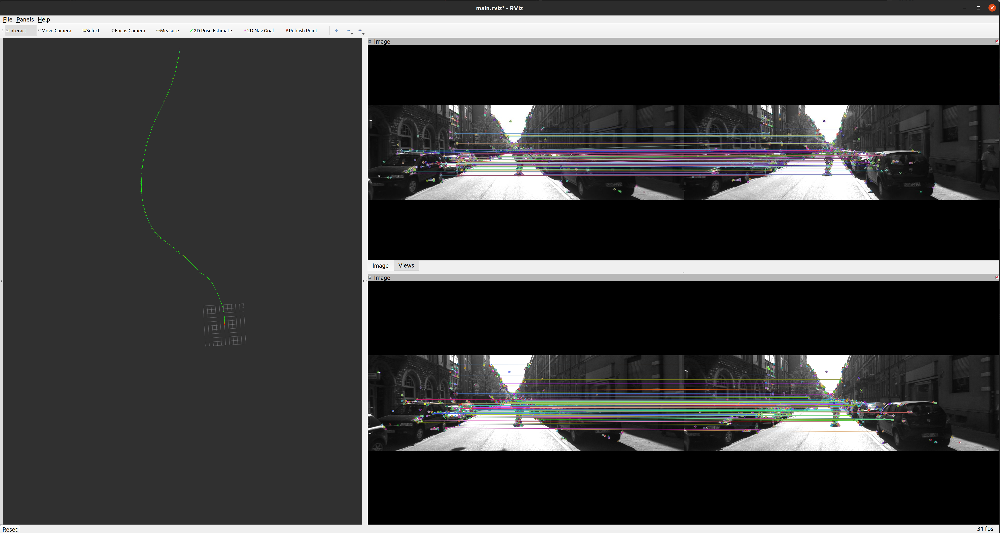
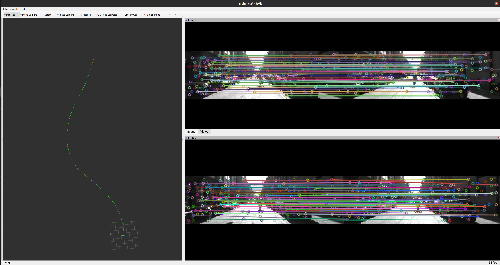

Lab 7: Group work on projects
===
The goal of this lab is for you to make progess on your project, together as a group. You'll set goals and work towards them, and report what you got done, chaellenges you faced, and subsequent plans.

Group name:
---
Group members present in lab today: Yuqing Qin (yuqingq), Yukun Xia (yukunx)

1: Plan
----
1. What is your plan for today, and this week? 

Today, we will go through the retraining process, and retrain a new superpoint model with different backbone (MobileNet v1). Also, we would continue working on the evaluation pipeline with ROS and C++.

2. How will each group member contribute towards this plan?

Yuqing is working on retraining the superpoint with different backbone.

Yukun is working on benchmarking the new model trained, and the pretrained models available online.

2: Execution
----
1. What have you achieved today / this week? Was this more than you had planned to get done? If so, what do you think worked well?

For retraining: we are using pytorch to train SuperPoint. There are four main steps as shown below:
- Prepare COCO, HPatches, and synthetic dataset.
- Train the MagicPoint (keypoint detector) with synthetic dataset
- Use this model to export COCO pseudo labels. 
- Train SuperPoint with COCO and its pseudo label.

From last lab, we already have the COCO pseudo label being exported. This lab, we start playing around with the backbone structure. Since the Superpoint requires the specific output resolution (w/4, h/4), therefore we have to keep the four convolutional block, but replace each convolution layer with the Depth seperable convolution layer used in the MobileNet v1. This allows us to have smaller amount of parameters compared to the original version.

For benchmarking: (Yukun)
- The Models we have now: 1. MagicLeap pretrained model  2. Another pretrained superpoint (from the repo) 3. the new model we trained (Sparse Loss) 4. The new model with MobileNet backbone
- The progress on the programming: We finished and tested the deployment of the original superpoint model in pure C++ code, using TensorRT and ROS. The verification is shown in Figure 1 below. We also tested the visual odometry on both classical (ORB) and SuperPoint frontend on a small KITTI sequence. The ORB visual odometry uses 375x1242 raw KITTI image, generating about 2k keypoints in an image (Figure 2). About half of them can pass the stereo or interframe matching, and the total running speed is ~11.6Hz. For the SuperPoint one, we downsized the image to 120x392, and the corresponding visual odometry had about 200 keypoints, and most of them passed both stereo or interframe matching. The frame rate is about 66.3Hz (Figure 3). The middle processing methods and hyperparameter of the two visual odometries are the same.

  

  <em>Figure 1. Superpoint running results from our C++ deployment code (top) and the original Python code (down)</em>

  

  <em>Figure 2. Stereo visual odometry with both ORB detector and descriptor. Left column: estimated path. Right top: stereo matching. Right bottom: interframe matching.</em>

  

  <em>Figure 3. Stereo visual odometry with both SuperPoint detector and descriptor. Left column: estimated path. Right top: stereo matching. Right bottom: interframe matching.</em>

2. Was there anything you had hoped to achieve, but did not? What happened? How did you work to resolve these challenges?

We were thinking of completely replace the backbone with mobilenet, but it turns out that SuperPoint has to have fixed output resolution so that they can be aligned with the pseudo labels we generated for COCO. This limits our capabilities to play around with the backbone. Therefore, we have to modify the mobilenet a little bit, just to make sure its output resolution aligns with our expectation. 

We also hoped to finish the deployment and some full tests on the KITTI dataset by the end of this lab report, but the postprocessing part of the deployment was much more time consuming than we thought. The original repository demo code was in Python and Numpy, and we had to translate those code into C++, with Eigen's Tensor module. We finished that, but hardly had time to get and store continuous data for a long run.

3. What were the contributions of each group member towards all of the above?

Yukun is working on benchmarking the performance with different models we got.
Yuqing is working on retraining the superpoint with different backbones.

3: Next steps
----
1. Are you making sufficient progress towards completing your final project? Explain why or why not. If not, please report how you plan to change the scope and/or focus of your project accordingly.

Yes. We are working on benchmarking the different variants of SuperPoint models. We are trying to collect as much as possible models to benchmark on. 

2. Based on your work today / this week, and your answer to (1), what are your group's planned next steps?

- keep retraining models (different loss, different backbone)
- quantization using tensorRT (float16, int8)
- different input resolution during inference time

3. How will each group member contribute towards those steps? 

Yuqing will continue working on retraining the network.
Yukun will continue working on benchmarking the model performance from retraining.
We will work together on the deployment.
