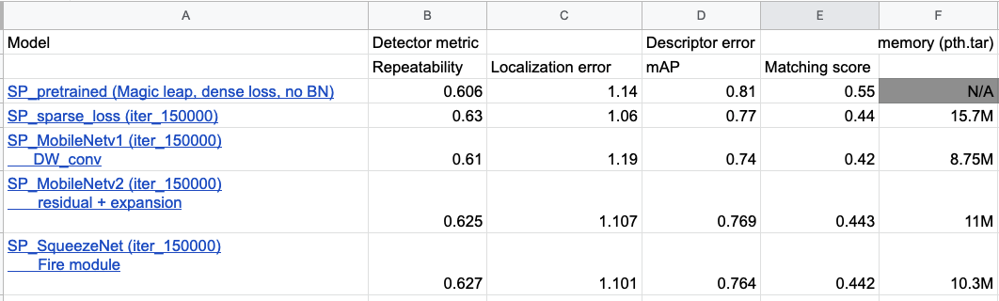

Lab 8: Group work on projects
===
The goal of this lab is for you to make progess on your project, together as a group. You'll set goals and work towards them, and report what you got done, chaellenges you faced, and subsequent plans.

Group name:
---
Group members present in lab today: Yuqing Qin (yuqingq), Yukun Xia (yukunx)

1: Plan
----
1. What is your plan for today, and this week? 

Today, we will continue working on retraining a few superpoint model with different backbone, including mobilenetv1, mobilenetv2, squeezenet. Also, we would start to benchmark the performance and memory usage for each new model.

2. How will each group member contribute towards this plan?

Yuqing is working on retraining the superpoint with different backbone, and output performance level metric and memory usage.

Yukun is working on the C++ and ROS for our benchmarking on KITTI. Most of the code has been finished, including a data loading and saving module, a visual odometry module, able to switch between different feature detection front end methods. These methods include classic one, like SIFT and ORB, as well as pertrained Superpoint models with different input resolution. 

2: Execution
----
1. What have you achieved today / this week? Was this more than you had planned to get done? If so, what do you think worked well?

For retraining: we are using pytorch to train SuperPoint. There are four main steps as shown below:
- Prepare COCO, HPatches, and synthetic dataset.
- Train the MagicPoint (keypoint detector) with synthetic dataset
- Use this model to export COCO pseudo labels. 
- Train SuperPoint with COCO and its pseudo label.

From last lab, we already have the COCO pseudo label being exported and one newly trained model with mobilenetv1 backbone structure. This lab, we have changed the backbones a little bit more (i.e. mobilenetv2, squeezenet) and retrained the superpoint with the new model structures. Then, benchmarked their performance on HPatches and memory usage. Also, we converted all trained models to onnx version, so that it can be easier to deploy later. Below Figure 1 summarizes our current result for the new trained models on HPatches.

For benchmarking, our data saving module saves output pose messages to local txt files, which are readable by the KITTI odometry evaluation tool. The evaluation tool could calculate both translation and rotation error for the whole testing sequence. We will compare the average translation and rotation errors from different models over the whole KITTI odometry dataset.

For deployment, we installed dependencies, including ROS, OpenCV, Eigen, and Ceres, on our Jetson Nano, and we've tested that our code is runnable on it. The official pretrained SuperPoint model was firstly transformed to onnx models, and further transformed to TensorRT engine files. Our visual odometry code leverages TensorRT's C++ API to run inference on different TensorRT engines.

  

  <em>Figure 1. Evaluation on HPatches and Memory Usage</em>

2. Was there anything you had hoped to achieve, but did not? What happened? How did you work to resolve these challenges?

We were thinking about using the Feature Paramid Network as another backbone, which is commonly used in the detection task. However, our output dimension is fixed by the definition of SuperPoint (H/8, W/8). And the current training input is (240, 360). If we would like to use FPN, we would expect the output resolution is (H/16, W/16) and further expand and sum up with the previous layer. However, this is not feasible with our current input resolution. Therefore, instead of using FPN as backbone, we used SqueezeNet as the backbone, which used a Fire module (squeeze + expansion in channel) to replace the original convoluation layers.    

3. What were the contributions of each group member towards all of the above?

Yukun is working on developing the code for benchmarking on KITTI and visualization code for our final demo.
Yuqing is working on retraining the superpoint with different backbones, and benchmarking on HPatches.

3: Next steps
----
1. Are you making sufficient progress towards completing your final project? Explain why or why not. If not, please report how you plan to change the scope and/or focus of your project accordingly.

Yes. We are working on benchmarking the different variants of SuperPoint models, and we have already get enough models for our further on-device benchmarking. The code for benchmarking on KITTI has already been developed as well. 

2. Based on your work today / this week, and your answer to (1), what are your group's planned next steps?

- apply quantization using tensorRT (float16, int8)
- benchmarking different input resolution during inference time

3. How will each group member contribute towards those steps? 

Yuqing will work on deploying the models on Jetson, and benchmarking the latency and power usage. 

Yukun will start the benchmarking on KITTI with new trained models, and apply quantization.